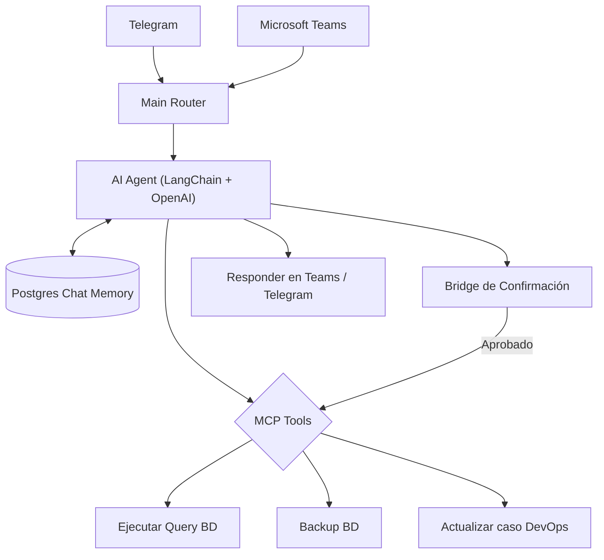

# 🤖 AI DevOps Agent — Teams & Telegram ChatOps

Agente de IA construido en **n8n** con **LangChain + OpenAI** que permite a un equipo de DevOps ejecutar operaciones internas (consultas a base de datos, backups, actualización de tickets, notificaciones) directamente desde **Microsoft Teams** o **Telegram**, sin salir del chat.

El agente entiende instrucciones en lenguaje natural, decide qué herramienta ejecutar (vía **MCP - Model Context Protocol**), mantiene memoria conversacional persistente en **PostgreSQL**, y responde de vuelta al canal de origen (Teams o Telegram) manteniendo el hilo de la conversación.

---

## 🗂️ Workflows incluidos

| # | Workflow | Función |
|---|---|---|
| 01 | `main-router` | Punto de entrada único: recibe casos desde múltiples canales y los enruta al flujo correcto. |
| 02 | `bridge-confirmacion-aprobacion` | Gestiona confirmaciones/aprobaciones humanas antes de ejecutar acciones sensibles. |
| 03 | `tool-ejecutar-query-bd` | Herramienta MCP para ejecutar consultas SQL controladas contra la base de datos. |
| 04 | `tool-backup-bd` | Herramienta MCP para disparar backups de base de datos bajo demanda. |
| 05 | `tool-actualizar-info-devops` | Herramienta MCP para actualizar tickets/casos de DevOps (Azure DevOps). |
| 06 | `tool-mandar-info-backup` | Envía el estado/resultado de un backup al canal correspondiente. |
| 07 | `flow-mandar-mensaje-teams` | Publica mensajes de salida en Microsoft Teams. |
| 08 | `flow-mandar-file-json` | Adjunta y envía archivos/resultados en formato JSON al canal. |
| 09 | `tg-recibir-mensajes-devops` | Trigger de entrada: recibe mensajes de Telegram para el agente. |
| 10 | `tg-recibir-mensaje-teams` | Trigger de entrada: recibe mensajes desde Teams vía Telegram bridge. |
| 11 | `recibir-mensaje-teams` | Webhook de entrada nativo de Teams. |

---

## 🏗️ Arquitectura

---

## 🛠️ Stack técnico

- **Agente de IA:** nodo `AI Agent` de LangChain sobre `OpenAI Chat Model`, con `Memory Buffer Window` + `Postgres Chat Memory` para contexto conversacional persistente.
- **Herramientas (Tools):** expuestas vía `MCP Client Tool`, permitiendo al agente decidir dinámicamente qué acción ejecutar según la instrucción del usuario.
- **Integraciones externas:** Azure DevOps (actualización de casos vía Azure Logic Apps) y Microsoft Teams (mensajería saliente).
- **Control de acceso:** flujo de confirmación/aprobación humana antes de ejecutar acciones potencialmente destructivas (ej. backups, queries de escritura).

---

## ⚙️ Cómo usar estos workflows

1. Importa los `.json` en tu instancia de n8n, en el orden sugerido por el prefijo numérico.
2. Configura tus propias credenciales:
   - **OpenAI API Key** (nodo `OpenAI Chat Model`).
   - Conexión a **PostgreSQL** (memoria del agente) y **SQL Server** (herramienta de queries).
   - Credenciales de **Telegram Bot** y del canal/webhook de **Microsoft Teams**.
   - Reemplaza el placeholder `YOUR_LOGIC_APP_ENDPOINT` / `sig=YOUR_SAS_SIGNATURE` por tu propia URL firmada de Azure Logic Apps si integras con Azure DevOps.
3. Conecta el `main-router` como punto de entrada y enlaza los sub-workflows mediante `Execute Workflow`.

---

## 🔒 Nota de seguridad

Este workflow manejaba originalmente credenciales operativas reales de un entorno productivo (endpoints internos, firmas SAS de Azure Logic Apps, organización de Azure DevOps, números de contacto). **Todo fue reemplazado por placeholders genéricos** antes de publicarse. Debes generar tus propias credenciales y URLs firmadas para ponerlo en marcha.

---

## 👤 Autor

**Alberto José Duque Gámez** — Backend & Automation Engineer
[GitHub](https://github.com/AlbertoDuque1006) · [LinkedIn](https://www.linkedin.com/in/alberto-jose-duque-gamez-088a04355/)
