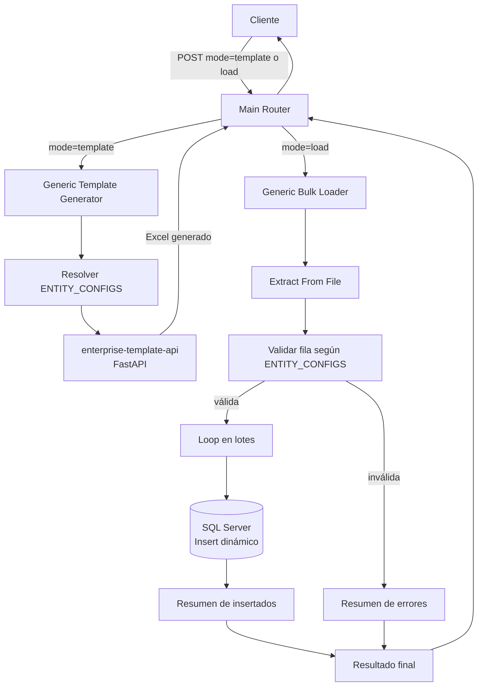

# 🧾 Bulk Data Engine — Generic Template & Load System

Motor **genérico y config-driven** en n8n para generar plantillas Excel y cargar masivamente cualquier tipo de dato (usuarios, medicamentos, contratos, inventario, etc.) hacia una base de datos empresarial, **sin duplicar un workflow por cada dominio**.

Esta es la evolución de un enfoque anterior donde existía un par de workflows independiente por cada entidad (`Cargue masivo de usuarios`, `Cargue masivo de medicamentos`, `Cargue masivo de contratos`...). Se refactorizó a **3 workflows únicos**, donde el comportamiento por entidad vive en un objeto de configuración (`ENTITY_CONFIGS`) en lugar de estar hardcodeado en flujos separados — el mismo patrón `TEMPLATE_BUILDERS` que ya usa [`enterprise-template-api`](https://github.com/AlbertoDuque1006/enterprise-template-api) en FastAPI.

De hecho, el generador de plantillas de este motor **llama directamente a esa API** en lugar de reimplementar la generación de Excel en n8n — cada sistema hace lo que mejor sabe hacer: n8n orquesta y valida, FastAPI construye el archivo.

---

## 🗂️ Workflows incluidos

| # | Workflow | Función |
|---|---|---|
| 00 | `main-router` | Punto de entrada único. Recibe `{ mode, entity, ... }` y enruta a generación de plantilla o cargue masivo. |
| 01 | `generic-template-generator` | Resuelve la configuración de la entidad solicitada y pide el Excel a `enterprise-template-api`. |
| 02 | `generic-bulk-loader` | Valida el archivo diligenciado fila por fila según la configuración de la entidad, y hace el insert dinámico en SQL Server. |


Agregar una nueva entidad ya **no requiere crear un workflow nuevo** — solo se agrega una entrada al objeto `ENTITY_CONFIGS` dentro del nodo `Code` correspondiente.

---

## 🏗️ Arquitectura



---

## 🛠️ Stack técnico


- **Config-driven:** una sola fuente de verdad por entidad (tabla destino, campos requeridos, tipos de dato) en lugar de un workflow por dominio.
- **Reutilización real entre proyectos:** el generador de plantillas consume la API REST de `enterprise-template-api` en lugar de reimplementar lógica de Excel.
- **Validación genérica:** el nodo `Code` valida cualquier entidad contra su configuración, reportando errores por fila sin detener el lote completo.
- **SQL dinámico y parametrizable:** el insert se construye a partir de la configuración de la entidad, evitando duplicar sentencias SQL por dominio.

---

## ⚙️ Cómo usar estos workflows

1. Importa los 3 archivos `.json` en n8n, en orden (`00`, `01`, `02`).
2. En `00-main-router.json`, reemplaza los placeholders `REPLACE_WITH_ID_OF_...` por el ID real de los workflows `01` y `02` una vez importados (n8n asigna el ID al importar).
3. En `02-generic-bulk-loader.json`, configura tu credencial real de **SQL Server** y ajusta `ENTITY_CONFIGS` al esquema real de tu base de datos (nombres de tabla y columnas).
4. En `01-generic-template-generator.json`, ajusta la URL del nodo HTTP Request para que apunte a tu propia instancia de `enterprise-template-api`.
5. Envía un `POST` a `main-router` con:
   ```json
   { "mode": "template", "entity": "USUARIOS", "filename": "plantilla_usuarios.xlsx" }
   ```
   o
   ```json
   { "mode": "load", "entity": "USUARIOS" }
   ```
   (adjuntando el archivo Excel diligenciado como binario).

---

## 🔒 Nota de seguridad

Los nombres de tabla y columnas en `ENTITY_CONFIGS` son **ilustrativos**, no corresponden al esquema real de ninguna base de datos productiva. Debes reemplazarlos por los de tu propio entorno antes de usar este motor en producción.

---

## 👤 Autor

**Alberto José Duque Gámez** — Backend & Automation Engineer
[GitHub](https://github.com/AlbertoDuque1006) · [LinkedIn](https://www.linkedin.com/in/alberto-jose-duque-gamez-088a04355/)
