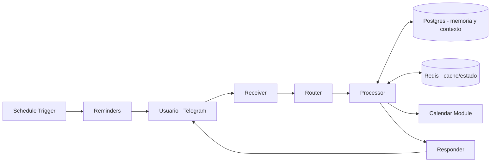

# 🧠 JARVIS — Personal AI Assistant

Asistente personal de IA construido íntegramente en **n8n**, orquestado como un sistema modular de agentes (router → receiver → processor → responder) que atiende mensajes de **Telegram**, gestiona un **calendario (Google Calendar)**, envía **recordatorios programados** y mantiene **memoria conversacional persistente**.

Diseñado con una arquitectura de microservicios internos: cada workflow tiene una responsabilidad única y se comunican entre sí mediante `Execute Workflow`, lo que permite escalar o reemplazar módulos sin afectar el resto del sistema.

---

## 🗂️ Workflows incluidos

| # | Workflow | Función |
|---|---|---|
| 01 | `jarvis-router` | Orquestador principal: decide a qué módulo enviar cada mensaje entrante. |
| 02 | `jarvis-receiver` | Punto de entrada de mensajes (Telegram / Webhook). |
| 03 | `jarvis-processor` | Procesa la intención del mensaje y prepara el contexto para el agente. |
| 04 | `jarvis-responder` | Genera y envía la respuesta final al usuario. |
| 05 | `jarvis-calendar` | Integración con Google Calendar (crear, consultar, actualizar y borrar eventos). |
| 06 | `jarvis-reminders` | Recordatorios programados (schedule trigger + notificación). |
| 07 | `jarvis-diagnostico` | Workflow de diagnóstico/salud del sistema. |
| 08 | `jarvis-migracion-db` | Script de migración e inicialización del esquema de base de datos (Postgres). |
| 09 | `jarvis-util-crear-folder` | Utilidad para crear estructuras de carpetas (ej. almacenamiento de archivos). |
| 10 | `jarvis-util-insertar-usuario` | Utilidad para registrar nuevos usuarios autorizados del asistente. |

---

## 🏗️ Arquitectura

---

## 🛠️ Stack técnico

- **Orquestación modular:** patrón router → receiver → processor → responder, cada uno como workflow independiente.
- **Persistencia:** PostgreSQL para historial/contexto conversacional, Redis para estado y caché de corto plazo.
- **Automatización temporal:** `Schedule Trigger` para recordatorios y tareas periódicas.
- **Integraciones:** Telegram Bot API y Google Calendar API.

---

## ⚙️ Cómo usar estos workflows

1. Ejecuta primero `jarvis-migracion-db` para crear el esquema de base de datos en tu propia instancia de PostgreSQL.
2. Importa el resto de workflows en el orden sugerido por el prefijo numérico.
3. Configura tus propias credenciales:
   - **Telegram Bot Token**.
   - Conexión a **PostgreSQL** y **Redis**.
   - Credenciales OAuth de **Google Calendar**.
4. Define tu propio código de registro en `JARVIS_WELCOME_CODE` (variable de entorno / tabla de configuración) — el valor original fue removido por seguridad.
5. Activa `jarvis-receiver` como punto de entrada.

---

## 🔒 Nota de seguridad

Se removieron identificadores personales (chat IDs, números de teléfono, ID de calendario real, túnel ngrok personal, código secreto de registro de usuarios) antes de publicar este proyecto. Reemplázalos por los tuyos al desplegarlo.

---

## 👤 Autor

**Alberto José Duque Gámez** — Backend & Automation Engineer
[GitHub](https://github.com/AlbertoDuque1006) · [LinkedIn](https://www.linkedin.com/in/alberto-jose-duque-gamez-088a04355/)
